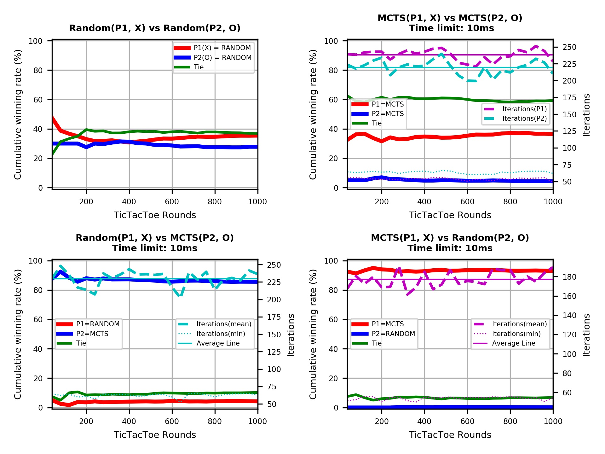
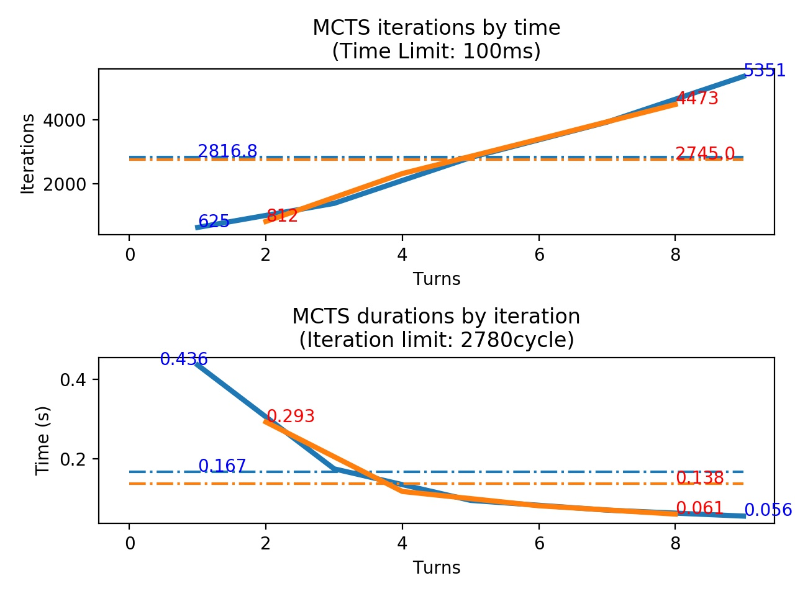
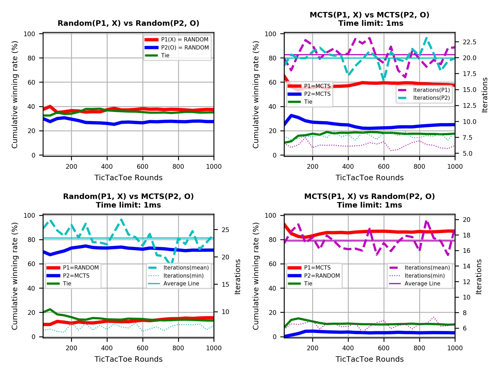
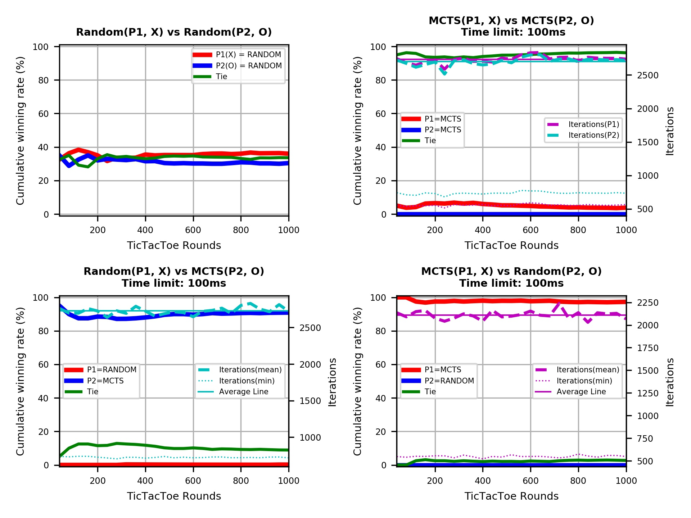
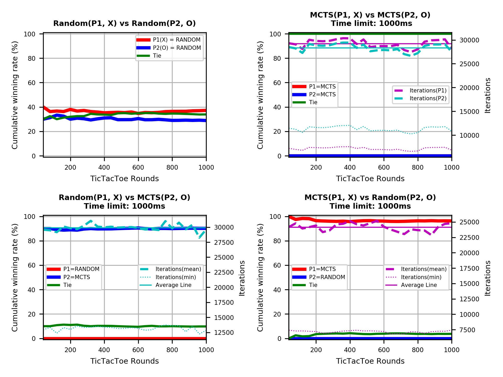

# Tic Tac Toe AI Analysis

## Requirements
- Matplotlib (Numpy)

## File Description
- General
  - TicTacToe.py : Provides TicTacToe Game
- AI
  - AI_minimax.py : Uses Minimax algorithm to get next action 
  - AI_mcts.py : Uses Monte Carlo Tree Searching(MCTS) algorithm to get next action
  - AI_random.py : Get random action (for comparison)
- Analysis
  - Analysis_mcts-winning-rate.py : Compare between MCTS algorithm and random algorithm
  - Analysis_mcts-iter-vs-time.py : Find relations between time duration and iterations on MCTS algorithm.

## How to use:
 You may change these values on your purpose
  - Analysis_mcts-winning-rate.py
  
    you can run alalysis whether Time-limit or Iteration-limit by changing 'mcts_criteria' property
  ```python
  mmm, rrr = 20, 10  # Match, Round
mcts_criteria = ['time', 100]  # ['time' or 'iter', milliseconds or iteration cycles]
plt_fontsize = {'title': 'x-small',
                'legend': 5,
                'x_lbl': 'x-small',
                'y_lbl': 'x-small',
                'tick_lbl': 'xx-small'}
fig_dpi = 300  # size of output img
look_through = True
   ```
   - Analysis_mcts-iter-vs-time.py
   ```python
   mcts_criteria_0 = ['time', 100]
fig_dpi = 200
```
## Examples
- MCTS vs Random with 1000ms of time limit
  - text:
  ```
  === Settings ===
  - Matchs, Rounds: 25, 40
  - Look Through: True
  - MCTS Setting: time, 10

  CASE Ⅰ. RANDOM VS RANDOM
  - P1 final winning rate: 35.4%
  - P2 final winning rate: 27.8%
  - Elapsed Time: 4.582s

  CASE Ⅱ. RANDOM VS MCTS
  - P1 final winning rate: 4.2%
  - P2 final winning rate: 85.6%
  - MCTS(P2) Iterations(average value): 229.819
  - MCTS(P2) Iterations(min value): 62.431
  - Elapsed Time: 38.961s

  CASE Ⅲ. MCTS VS Random
  - P1 final winning rate: 93.0%
  - P2 final winning rate: 0.2%
  - MCTS(P2) Iterations(average value): 177.1703
  - MCTS(P2) Iterations(min value): 53.791
  - Elapsed Time: 39.365s

  CASE Ⅳ. MCTS VS MCTS
  - P1 final winning rate: 36.4%
  - P2 final winning rate: 4.3%
  - MCTS(P1) Iterations(average value): 238.0544
  - MCTS(P1) Iterations(min value): 53.719
  - MCTS(P2) Iterations(average value): 219.2932
  - MCTS(P2) Iterations(min value): 63.538
  - Elapsed Time: 90.806s

  Wed Jun 20 01:22:17 2018
  ```
  - plot:
    

- Time-Iteration relationship in MCTS
  


## Results
(You may see MCTS gets smarter with higher time limit)

- 1ms:

- 10ms:

- 100ms:

- 1000ms:


## Some concerns
- As you see on time-iteration relationship, MCTS loop(or 'selection phase') runs slower at initial state. This may due to my optimization technique, or not.
